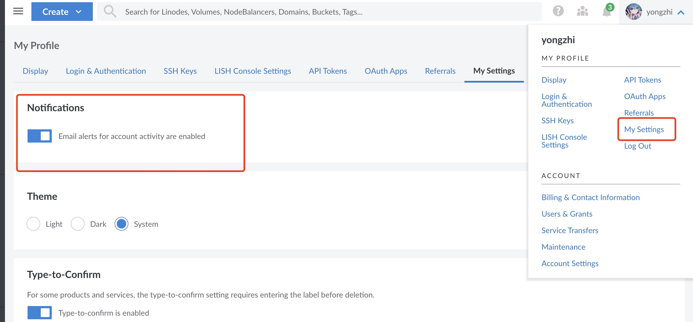
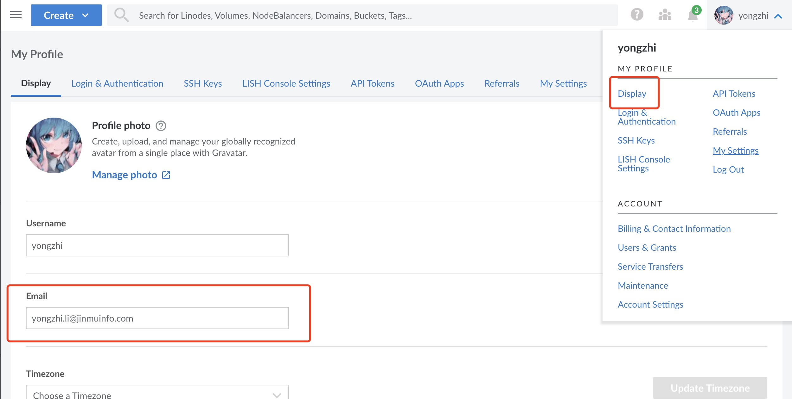

# 账号基本信息

### Q：如何更换告警邮箱

关闭邮箱告警

更换告警邮箱

 

### Q：如何获取账号的customer id

A：提case给support 查询本账号的customer id

### Q：账单信息是否能根据子账号区分

A：不可以，一个账号下的所有子账号与主账号共有一份账单

# 账号限额

### Q：如何解除账号限额

​		A：通过提case 联系support人员解除限制

### Q：是否解除了之后 就不用管配额了

​		A：Linode 会根据账号情况给您的账号进行评级 不同等级账号拥有不用的配额 解除限额只是提升当前账号的配额上限 在有需求的情			  况下可以通过提case 说明情况提升配额

