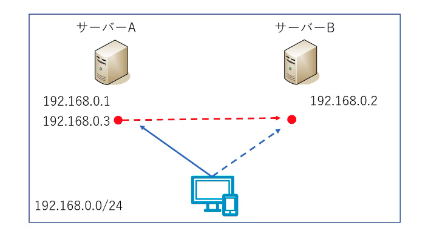
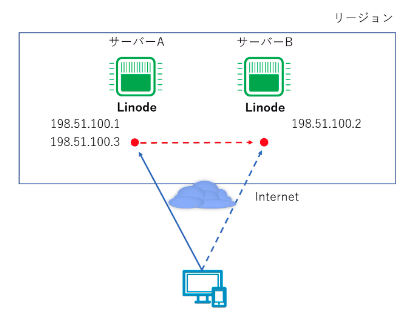
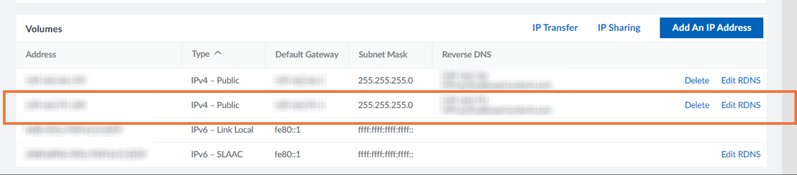

# 在 Linode 上使用 IP 共享实现故障转移配置


### 介绍

如果要为正在构建的系统中的服务器创建基于 IP 地址的故障转移配置，则需要使用其中一种方法来继承服务器之间的 IP 地址。常见的配置包括以下模式： （所有IP地址均为示例）

- 将IP-A（192.168.0.1）分配给服务器A，IP-B（192.168.0.2）分配给服务器B，分配IP-C（192.168.0.3）进行共享，有IP-C的服务器响应。 C、发生故障时。



* 将IP-A（192.168.0.1）分配给服务器A，将IP-B（192.168.0.2）分配给服务器B，并在发生故障时接管IP-A。这是一种不太常见的模式。 IP-B 用于管理目的


在 Linode 中，每个实例通常都会分配一个 IP 地址，但您可以使用 Linode 的 IP 共享功能来分配多个 IP 地址并共享这些 IP 以创建故障转移配置。



实现冗余配置和负载均衡的另一种方法是使用 NodeBalancers，Linode 的托管负载均衡器。本文描述的使用IP地址方法的故障转移配置适用于使用Linode实例构建负载均衡器时，或者由于某种原因需要直接与客户端通信时。


### 故障转移方法

IP 共享的概述可以在 Linode 文档中找到。
请注意，不同数据中心的故障转移方法和使用的软件有所不同，必须根据Linode实例所在的数据中心进行配置。提交时东京区域支持的故障转移方法是基于 ARP 的 KeepAlived 方法。 （请查看以下网址以获取最新信息）

主要有 BGP（互联网的路由协议）等术语，以及 lelastic 和 FRR 等不熟悉的术语，但不用担心。由于这是 Linode 环境中的分步过程，因此您只需检查文档并配置设置即可创建故障转移配置。

如果要为公共 IP（全局 IP 地址）配置故障转移配置，则需要向一个实例添加第二个 IP 地址。要添加全球IP地址，您需要从IPv4地址耗尽的角度向Linode客户支持申请，因此我们希望本文对您理解该过程有所帮助。


### 提前准备

在同一地域创建两个Linode实例。这次，我结合支持的故障转移方法创建了它。

- 基于ARP的KeepAlived方法：东京地区
- 基于BGP的弹性方法：新加坡地区


我们选择“Ubuntu 22.04 LTS”作为发行版，因此如果您使用其他发行版，请替换Linode文档中列出的命令。

首先，安装 Apache。使用任何用户名创建 sudo 用户。

```powershell
# adduser -a user01
# gpasswd -a user01 sudo
# 以用户身份重新登录，然后用sudo运行它。
$ sudo apt update
$ sudo apt install apache2 -y
$ sudo vi /var/www/html/server.html
```

创建一个简单的 HTML 文件，以便您可以看到它已连接到服务器 A。

```html
<html><head></head><body><h1>
Server-A
</h1></body></html>
```

以同样的方式创建服务器B。

```html
<html><head></head><body><h1>
Server-B
</h1></body></html>
```

在两台服务器上启动 Web 服务器。

```powershell
$ sudo systemctl start apache2
$ sudo systemctl enable apache2
```

当我访问服务器A的全局IP时，我看到“服务器A”。
http://[Linode全球IP]/server.html


类似地，对于服务器B，显示“服务器B”。


### 基于ARP的KeepAlived方法

这是东京地区等支持的方法。这里介绍的步骤基于下面的 URL，但对配置文件进行了一些更改。


#### 添加公共IP地址

从 Linode 实例的网络设置中将 IP 地址添加到服务器 A。请注意，将产生额外费用（截至 2023 年 4 月，每个 IP 每月 2 美元）。


如果您想添加公共全球IP地址，您需要向客户支持申请。如果您尚未申请，将会显示以下消息，并且您将无法添加。


这次，要使全局 IP 地址冗余，请选择“公共”并单击“分配”。


第二个“IPv4 - 公共”已分配




### IP共享设置

为您之前分配的公共 IP 配置 IP 共享。
在服务器B的网络设置中点击“IP共享”。


选择您之前分配的服务器 A 的**第二个公共 IP**，然后单击“保存”


服务器 A 的共享 IP 被分配为“IPv4 - 共享”。


#### 安装和配置keepalived

在两台服务器上安装 keepalived。

```powershell
$ sudo apt update && sudo apt upgrade
$ sudo apt install keepalived
$ sudo vi /etc/keepalived/keepalived.conf
```

在服务器A上创建keepalived.conf，如下所示。

```powershell
global_defs {
}

vrrp_script check_apache2 {
    script "/etc/keepalived/apache2-check.sh"
    interval 2
    fall 2
    rise 2
}

vrrp_instance Instance1 {
    state MASTER
    interface eth0
    virtual_router_id 10
    priority 100
    advert_int 1
    authentication {
        auth_type PASS
        auth_pass fowebpass    #fowebpass就是一个例子。输入一个共同的密码
    }
    unicast_src_ip 198.51.100.1 #左边是一个例子。列出服务器A的第一个公共IP
    unicast_peer {
       198.51.100.2   #左边是一个例子。列出服务器B的公共IP
    }
    virtual_ipaddress {
       198.51.100.3   #左边是个例子。列出通过IP Sharing分配的IP
    }
    track_script {
      check_apache2
    }
}
```

同样，在服务器B上创建keepalived.conf，如下所示。

```powershell
global_defs {
}

vrrp_script check_apache2 {
    script "/etc/keepalived/apache2-check.sh"
    interval 2
    fall 2
    rise 2
}

vrrp_instance Instance1 {
    state BACKUP    # 服务器B更改为备份。
    interface eth0
    virtual_router_id 10
    priority 99    # 服务器B更改为99
    advert_int 1
    authentication {
        auth_type PASS
        auth_pass fowebpass    #fowebpass就是一个例子。输入一个共同的密码
    }
    unicast_src_ip 198.51.100.2 #左边是一个例子。列出服务器B的公共IP
    unicast_peer {
       198.51.100.1   #左边是个例子。列出服务器A的第一个公共IP
    }
    virtual_ipaddress {
       198.51.100.3   #左边是一个例子。列出通过IP Sharing分配的IP
    }
    track_script {
      check_apache2
    }
}
```

添加一个简单的脚本来检查两台服务器上的 apache2 进程运行状况。

```powershell
$ sudo vi /etc/keepalived/apache2-check.sh
```

```powershell
#!/bin/bash
systemctl is-active apache2
```

更改脚本权限并启动keepalived。

```powershell
$ sudo chmod 744 /etc/keepalived/apache2-check.sh
$ sudo systemctl enable keepalived
$ sudo systemctl start keepalived
```

检查状态。
登录服务器A如下。为了防止它成为多主设备，它以 BACKUP STATE 启动，您可以看到它立即被选为 MASTER STATE。

```powershell
$ sudo tail -20 /var/log/syslog  | grep Keepalive
Mar 27 01:26:09 localhost systemd[1]: Started Keepalive Daemon (LVS and VRRP).
Mar 27 01:26:09 localhost Keepalived_vrrp[10352]: VRRP_Script(check_apache2) succeeded
Mar 27 01:26:09 localhost Keepalived_vrrp[10352]: (Instance1) Entering BACKUP STATE
Mar 27 01:26:12 localhost Keepalived_vrrp[10352]: (Instance1) Entering MASTER STATE
```

共享IP应用于eth0。

```powershell
$ sudo ip addr
2: eth0: <BROADCAST,MULTICAST,UP,LOWER_UP> mtu 1500 qdisc mq state UP group default qlen 1000
    link/ether xx:xx:xx:xx:xx:xx brd ff:ff:ff:ff:ff:ff
    inet サーバーAのIP/24 brd BROADCAST scope global eth0
       valid_lft forever preferred_lft forever
    inet 共有IP/32 scope global eth0
       valid_lft forever preferred_lft forever
```

登录服务器B如下。可以看到它处于 BACKUP STATE 状态。

```powershell
$ sudo tail -20 /var/log/syslog  | grep Keepalive
Mar 27 01:26:13 localhost systemd[1]: Started Keepalive Daemon (LVS and VRRP).
Mar 27 01:26:13 localhost Keepalived[48819]: Startup complete
Mar 27 01:26:13 localhost Keepalived_vrrp[48820]: VRRP_Script(check_apache2) succeeded
Mar 27 01:26:13 localhost Keepalived_vrrp[48820]: (Instance1) Entering BACKUP STATE
```

不应用共享IP。

```powershell
$ sudo ip addr
2: eth0: <BROADCAST,MULTICAST,UP,LOWER_UP> mtu 1500 qdisc mq state UP group default qlen 1000
    link/ether xx:xx:xx:xx:xx:xx brd ff:ff:ff:ff:ff:ff
    inet サーバーBのIP/24 brd BROADCAST scope global eth0
       valid_lft forever preferred_lft forever
```

当您从计算机的浏览器访问共享 IP 时，服务器 A 会做出响应。


#### 服务器切换

进行切换。现在停止apache。

```powershell
$ sudo systemctl stop apache2
```

当您从计算机的浏览器访问共享 IP 时，服务器 B 会做出响应。


同时，我从我的电脑上使用 ping 检查服务器切换情况。

```powershell
> ping 公有IP -t
Response from shared IP: Bytes = 32 hours = 30ms TTL = 49
Response from shared IP: Bytes = 32 hours = 31ms TTL = 49
The request has timeout. # I'm switching here.
Response from shared IP: Byte = 32 hours = 29ms TTL = 49
Response from shared IP: Bytes = 32 hours = 32ms TTL = 49

```

检查状态。
登录服务器A如下。您可以看到它处于故障状态

```powershell
$ sudo tail -20 /var/log/syslog  | grep Keepalive
root@localhost:~# tail -50 /var/log/syslog  | grep Keepalive
Mar 27 02:02:21 localhost Keepalived_vrrp[10352]: Script `check_apache2` now returning 3
Mar 27 02:02:23 localhost Keepalived_vrrp[10352]: VRRP_Script(check_apache2) failed (exited with status 3)
Mar 27 02:02:23 localhost Keepalived_vrrp[10352]: (Instance1) Entering FAULT STATE
```

不应用共享IP。

```powershell
$ sudo ip addr
2: eth0: <BROADCAST,MULTICAST,UP,LOWER_UP> mtu 1500 qdisc mq state UP group default qlen 1000
    link/ether xx:xx:xx:xx:xx:xx brd ff:ff:ff:ff:ff:ff
    inet サーバーAのIP/24 brd BROADCAST scope global eth0
       valid_lft forever preferred_lft forever

```

登录服务器B如下。可以看到已经切换到MATER STATE了。

```powershell
$ sudo tail -20 /var/log/syslog  | grep Keepalive
Mar 27 01:35:07 localhost Keepalived_vrrp[48820]: (Instance1) Entering BACKUP STATE
Mar 27 02:02:24 localhost Keepalived_vrrp[48820]: (Instance1) Entering MASTER STATE

```

共享IP应用于服务器B上的eth0。

```powershell
$ sudo ip addr
2: eth0: <BROADCAST,MULTICAST,UP,LOWER_UP> mtu 1500 qdisc mq state UP group default qlen 1000
    link/ether xx:xx:xx:xx:xx:xx brd ff:ff:ff:ff:ff:ff
    inet サーバーBのIP/24 brd BROADCAST scope global eth0
       valid_lft forever preferred_lft forever
    inet 共有IP/32 scope global eth0
       valid_lft forever preferred_lft forever
```

当服务器A的apache再次启动时，它会故障恢复并且服务器A会做出响应


### 基于BGP的弹性方法

下面介绍新加坡地区支持的使用 lelastic 的方法。
该文档列在以下 URL 中。

安装apache等基本服务器准备与“提前准备”中相同，但区域选择新加坡。


#### 添加公网IP地址并设置IP共享

与 keepalived 一样，添加公共 IP 并配置 IP 共享。

####  将共享IP添加到Linux网络配置中

将共享 IP 应用到两台服务器的 lo 接口。

```powershell
$ sudo vi /etc/netplan/01-netcfg.yaml
network:
  version: 2
  renderer: networkd
  ethernets:
    eth0:
      dhcp4: yes
    lo:   #从这里添加
      match:
        name: lo
      addresses:
        - 共有IP/32  #请给我一个/32。

```

应用设置。您可以确认共享IP已分配给lo接口。

```powershell
$ sudo netplan apply
$ ip addr

1: lo: <LOOPBACK,UP,LOWER_UP> mtu 65536 qdisc noqueue state UNKNOWN group default qlen 1000
    link/loopback 00:00:00:00:00:00 brd 00:00:00:00:00:00
    inet 127.0.0.1/8 scope host lo
       valid_lft forever preferred_lft forever
    inet 共有IP/32 scope global lo
       valid_lft forever preferred_lft forever
    inet6 ::1/128 scope host
       valid_lft forever preferred_lft forever
2: eth0: <BROADCAST,MULTICAST,UP,LOWER_UP> mtu 1500 qdisc mq state UP group default qlen 1000
    link/ether xx:xx:xx:xx:xx:xx brd ff:ff:ff:ff:ff:ff
    inet 一つ目のPublic IP/24 brd BROADCAST scope global eth0
       valid_lft forever preferred_lft forever
    inet 共有IP/24 brd BROADCAST scope global eth0


```

#### 安装和配置 lelastic

在两台服务器上安装 leastic。请检查以下 URL 中的版本并将其应用于下一个命令的参数。
https://github.com/linode/lelastic/releases

重写到确认的版本并安装。

```powershell
version=v0.0.6
curl -LO https://github.com/linode/lelastic/releases/download/$version/lelastic.gz
gunzip lelastic.gz
chmod 755 lelastic
sudo mv lelastic /usr/local/bin/
```

创建启动脚本。

- [id] 从故障转移方法列表中获取区域 ID 并应用它。
  https://www.linode.com/docs/products/compute/compute-instances/guides/failover/#ip-sharing-availability
- 对于 [角色]，为服务器 A 选择主服务器，为服务器 B 选择辅助服务器。

修改【id】和【role】并创建。
两台服务器上的设置相同。

```powershell
$ sudo vi /etc/systemd/system/lelastic.service

```

```powershell
[Unit]
Description= Lelastic
After=network-online.target
Wants=network-online.target

[Service]
Type=simple
ExecStart=/usr/local/bin/lelastic -dcid [id] -[role] &
ExecReload=/bin/kill -s HUP $MAINPID

[Install]
WantedBy=multi-user.target

```

开始共享。

```powershell
$ sudo chmod 644 /etc/systemd/system/lelastic.service
$ sudo systemctl start lelastic
$ sudo systemctl enable lelastic

```

当您从计算机的浏览器访问共享 IP 时，服务器 A 会做出响应。


####  服务器切换

进行切换。这里我们将停止服务器A。

```powershell
$ sudo shutdown -h now

```

当您从计算机的浏览器访问共享 IP 时，服务器 B 会做出响应。


同时，我从我的电脑上使用 ping 检查服务器切换情况。

```powershell
> ping 共有IP -t
Response from shared IP: Byte = 32 hours = 210ms TTL = 44
Response from shared IP: Byte = 32 hours = 203ms TTL = 44
The request has timeout. # I'm switching here.
Response from shared IP: Byte = 32 hours = 204ms TTL = 44
Response from shared IP: Byte = 32 hours = 209ms TTL = 44

```

当服务器A的操作系统再次启动时，发生故障恢复并且服务器A做出响应。


### 概括

我们介绍了如何使用 Linode 实现基于 IP 地址的故障转移配置。在不使用 NodeBalancer 的情况下实现基于 IP 地址的服务器冗余时，请参考官方文档。