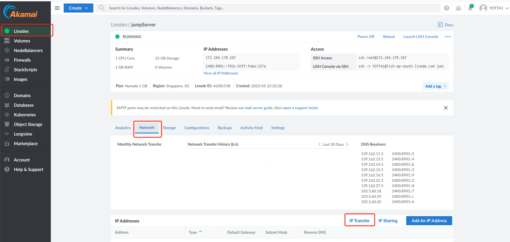

### Q: Linode服务器的磁盘默认类型是什么？

​       A: 所有的Linode都采用SSD存储

### Q: 服务器关机了是否还继续收费

A: 还会收费，直到删除了这个服务器

### Q: Transfer是包月流量吗？network是速度上限吗？如果超了怎么算？

A: transfer是包月流量 network是带宽 流量如果用超了包月的 超出部分1TB 5$

​	

### Q：Linode 现在有香港节点吗？后面会有香港节点吗?

A：现在没有香港节点，未来会有（明年）。

### Q： 如何通过自定义镜像创建服务器

A： 上传镜像到 linode

这里只支持上传.gz这一种格式的文件 

上传之后根据镜像进行创建

对于上传的镜像也可以通过linode api的形式创建服务器

### Q：如何更换服务器的ip

A：更换服务器的ip只能在同属于一个region的服务器之间进行，所以事先要准备好一个同region的服务器，然后与当前服务器进行IP Transfer

内网IP与外网ip都可以进行transfer

### Q：Linode是否支持vyos操作系统

A：没有直接可以创建的镜像，也不能直接以上传的镜像创建，需要按照教程自己实现

参考教程：[在linode上安装vyos](https://www.linode.com/community/questions/18630/how-do-i-install-vyos-on-my-linode)

​					[安装自定义镜像](https://www.linode.com/docs/products/compute/compute-instances/guides/install-a-custom-distribution/)

### Q：Linode是否支持自动扩容

A：不支持

<<<<<<< HEAD
### Q：Linode 是否支持在线扩缩容

A：不支持，扩容与缩容都会导致服务器重启，不支持在线扩缩。缩容配置需要手动把磁盘缩小配置。

### Q：Linode 是否支持IPv6，是否支持额外新增IPv6,如何使用

A：支持IPv6，也支持额外新增，新增一个可以直接操作，新增多个需要联系support。关于IPv6，这里新增的是地址段。

### Q: Linode 重建(rebuild)后IP会改变吗？

A： 不会改变，重建前后IP不变
=======
### Q：创建Linode服务器时没有添加私有ip,后续追加私有ip但是在服务器内部通过命令查看，查看不到私有ip，如何解决？

A：首先那台Linode服务器需要启动Network Helper，其次添加完私有ip后需要重启服务器
>>>>>>> 60cd5a993f8a13a3793d38aa005f550a9c56a212
