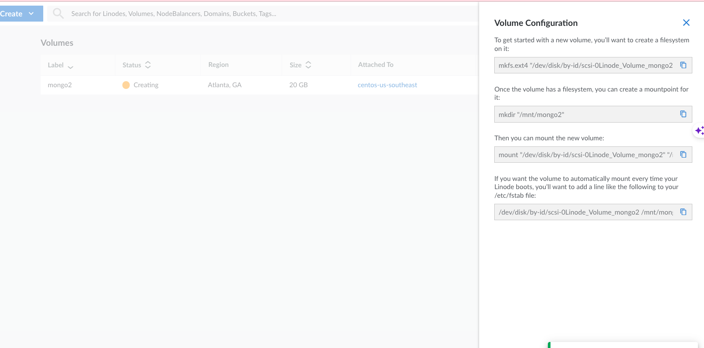

# Q：如何通过Linode挂载Volume，并且搭建NFS Serve

A：Linode中BlockStorage对应的就是Volume这个产品。

      1. 挂载Volume到某个Linode上，按照创建后的Volume的配置信息直接在attch的服务器上进行挂载即可，这里要注意挂载目录

​       

2. 在挂载了volume的serve上部署NFS server

   参考：https://www.linode.com/docs/guides/how-to-mount-nfs-shares-on-debian-9/

   ！对于LKE 来说 创建的PVC 对应到Volume中

注意点：

1. 如果想对磁盘进行扩展，是不支持在线扩展的

